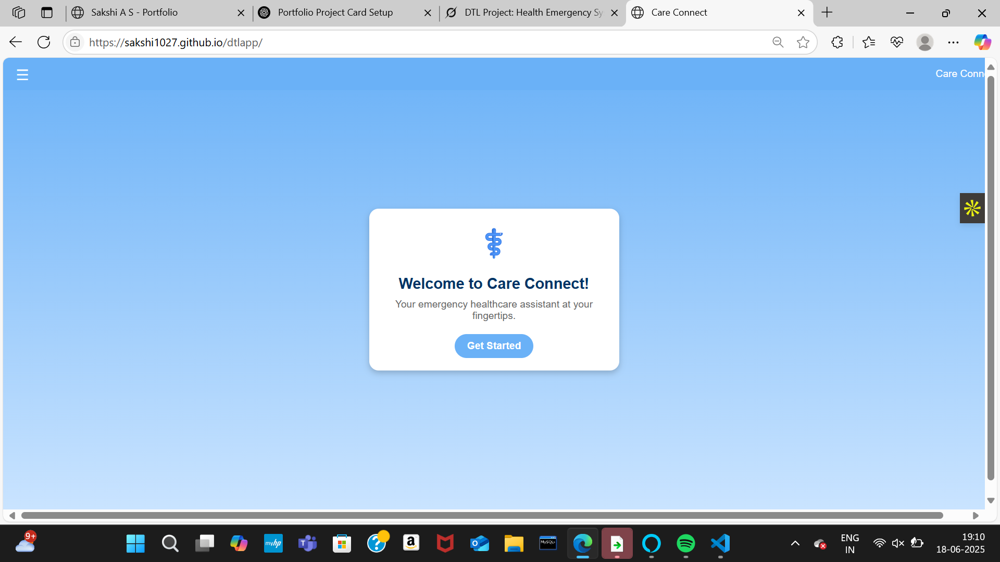
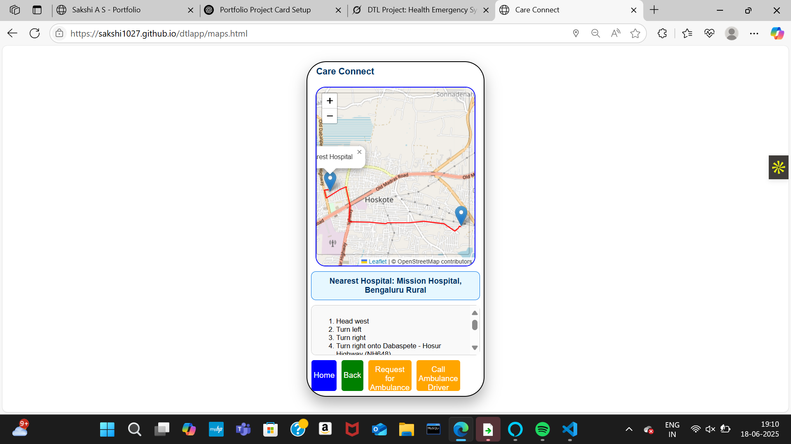
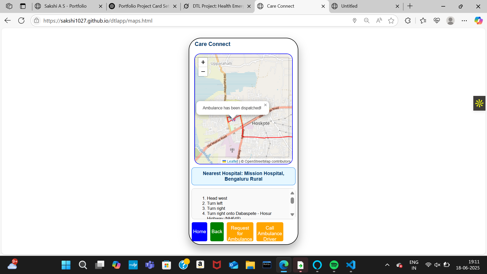

# Care Connect - Real-Time Healthcare Assistance System

## Overview
**Care Connect** is a real-time healthcare assistance system designed to provide emergency support to users. It locates the **nearest hospital** using geolocation, displays an optimized route, and enables **ambulance dispatch** with a simulated movement animation. It also includes a **hospital dashboard** for real-time updates on patient data, staff availability, and ambulance status.

## Features
- **Emergency Assistance**: Locate the nearest hospital and show the best route.
- **Ambulance Dispatch**: Simulated ambulance movement to the user’s location.
- **Hospital Dashboard**: Real-time updates on patient data, staff availability, and ambulance status.

## Technologies Used
- HTML/CSS/JavaScript: For frontend development.
- Leaflet.js and Routing Machine: For map rendering and route calculation.
- OpenStreetMap: Provides map data.
- Firebase: For potential real-time data integration (in progress).
- LocalStorage: For storing user location, hospital details, and dispatch messages.

## Installation
1. Clone the repository:git clone https://github.com/Sakshi1027/dtlapp.git
2. Navigate to the project directory:
3. Open `index.html` in a web browser to start the app locally.

## Usage
- **Welcome Page (`index.html`)**: Click "Get Started" to access the map.
- **Map Interface (`maps.html`)**: Use "Emergency Help" to find the nearest hospital and route, then request ambulance service.
- **Hospital Dashboard (`hd.html`)**: View real-time data and monitor ambulance status.
- Allow geolocation access when prompted.

## Visuals

## Contributing
Feel free to fork this repository and submit pull requests. For major changes, open an issue to discuss.

## Future Improvements
- Integrate Firebase for real-time updates.
- Enhance ambulance tracking with GPS data.
- Complete additional pages (`emergency.html`, `health.html`, etc.).
- Add user authentication.

## Contact
Reach out to Sakshi at [sakshias.cs23@rvce.edu.in](mailto:your-email@example.com).
